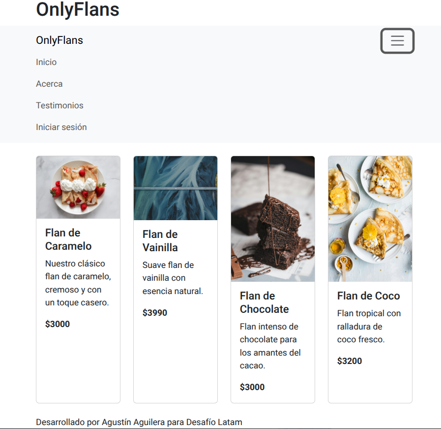
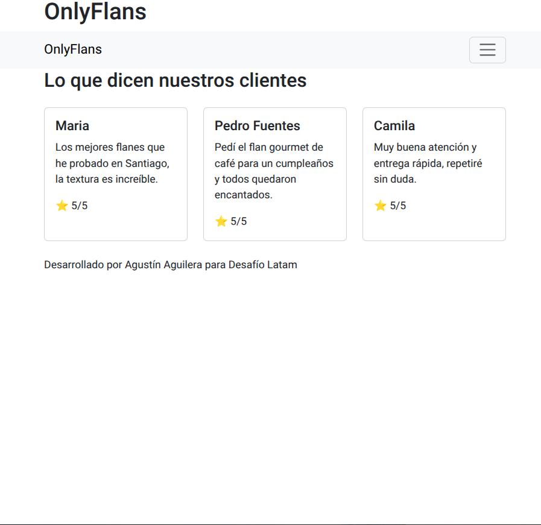
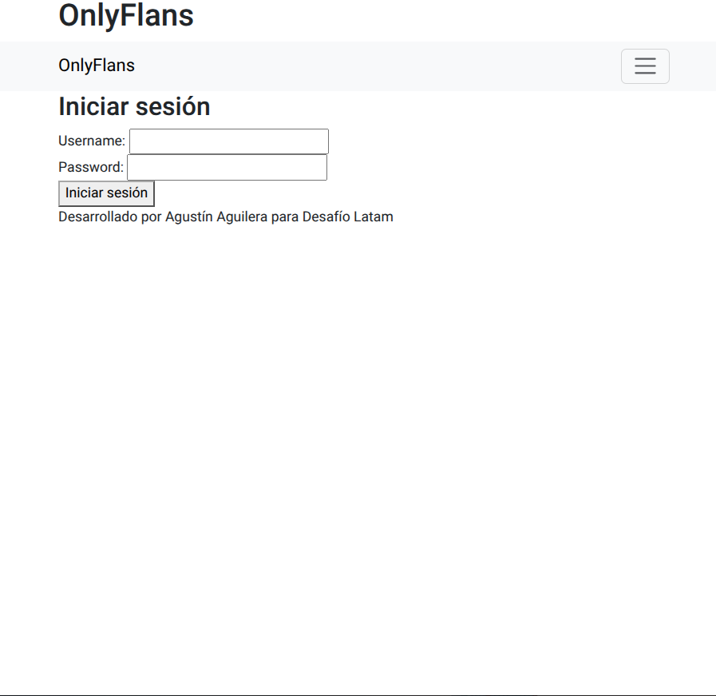

# OnlyFlans

Sitio web para una PYME de flanes y postres, desarrollado con **Django 5.2** y **Bootstrap 5** como proyecto final del bootcamp *Desarrollo de Aplicaciones Full Stack Python Trainee* (Desafío Latam).

## Qué incluye

- **Catálogo público**: la página de inicio muestra los flanes públicos en tarjetas responsivas.
- **Zona privada**: la vista `/bienvenido` muestra los flanes exclusivos y solo es accesible con sesión iniciada (`@login_required`).
- **Autenticación**: inicio y cierre de sesión con las URLs de Django, plantillas propias y cierre de sesión por `POST` con token CSRF.
- **Navegación dinámica**: el menú cambia según el usuario esté autenticado o no.
- **Formulario de contacto**: modelo `ContactForm` con `ModelForm`, validación y página de éxito.
- **Testimonios**: modelo `Testimonio` con calificación, visible en `/testimonios`.
- **Panel de administración** para gestionar flanes, mensajes y testimonios.
- **Plantillas reutilizables**: herencia con `base.html` y fragmentos (`header`, `navbar`, `footer`) mediante `include`.

## Capturas

| Inicio | Testimonios | Inicio de sesión |
|---|---|---|
|  |  |  |

## Cómo ejecutarlo

```bash
python3 -m venv env
source env/bin/activate
pip install -r requirements.txt

python3 manage.py migrate
python3 manage.py loaddata datos_iniciales   # flanes y testimonios de ejemplo
python3 manage.py createsuperuser            # para entrar al panel /admin
python3 manage.py runserver
```

Abre <http://127.0.0.1:8000/>.

## Pruebas

```bash
python3 manage.py test
```

Incluyen: filtrado de flanes públicos y privados, acceso protegido, testimonios y el formulario de contacto (caso válido e inválido).

## Configuración

| Variable de entorno | Uso | Valor por defecto |
|---|---|---|
| `DJANGO_SECRET_KEY` | Clave secreta de Django | clave solo para desarrollo local |
| `DJANGO_DEBUG` | `True` o `False` | `True` |

Para producción define una clave propia y `DJANGO_DEBUG=False`. La base de datos local (`db.sqlite3`) no se sube al repositorio.

## Tecnologías

Python · Django · SQLite · HTML · Bootstrap 5

## Autor

**Agustín Aguilera Montecinos**, [LinkedIn](https://www.linkedin.com/in/agustinaguilerach/)
